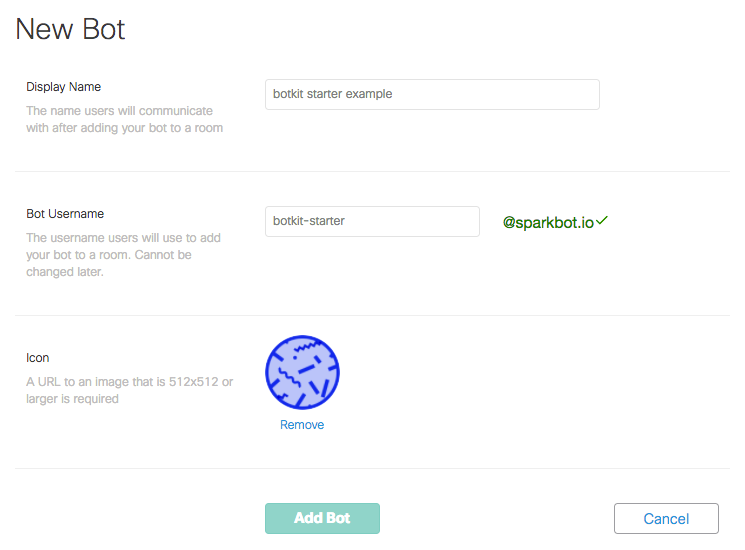

# Configure Botkit and Cisco Spark

Setting up a bot for Cisco Spark is one of the easiest experiences for bot developers! Follow these steps carefully to configure your bot.

### 1. Install Botkit

The easiest path to creating a new bot for Cisco Spark is through Botkit Studio. [Sign up for an account here](https://studio.botkit.ai/signup/). This method will provide a guided path to hosting, along with other useful tools for creating and managing your bot.

For advanced users looking to run their own code, you will need to [install Botkit](../readme-ciscospark.md#getting-started) and run it before your bot can be configured with Cisco Spark. 

### 2. Create a new bot in the Cisco Developer portal

Follow the instructions to create a new bot in the [Cisco Spark Developer Portal](https://developer.ciscospark.com/add-bot.html). 

Take note of the bot username, you'll need it later.

**Note about your icon**: Cisco requires you host an avatar for your bot before you can create it in their portal. This bot needs to be a 512x512px image icon hosted anywhere on the web. This can be changed later.

You can copy and paste this URL for a Botkit icon you can use right away: 

https://raw.githubusercontent.com/howdyai/botkit-starter-ciscospark/master/public/default_icon.png

### 3. Copy your access token

Cisco will provide you an `access token` that is specific to your bot. Write this down, you won't be able to see this later (but you will be able revoke it and create a new one).

### 4. Run your bot with variables set

 [Follow these instructions](../readme-ciscospark.md#getting-started) to run your bot locally, or by using a third-party service such as [Glitch](https://glitch.com) or [Heroku](https://heroku.com).
 
 You will need the following environment variables when running your bot:
 
 * `access_token` = Your token from Cisco Spark (**required**)
 * `secret` = User-defined string to validate payloads  (**required**)
 * `public_address`=  URL of your bot server (**required**)
 * `studio_token`= [Botkit Studio](https://studio.botkit.ai)  API token (optional)

You should now be able to search your Cisco Spark team for the bot username you defined, and add it to your team!

### Additional resources

Read more about making bots for this platform in the [Cisco Developer Portal](https://developer.ciscospark.com/bots.html).
