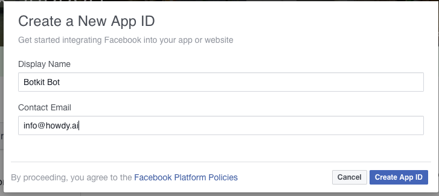
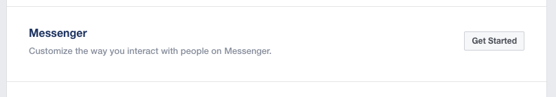

# Configure Botkit and Facebook Workplace

### 1. [Install Botkit](https://github.com/howdyai/botkit/blob/master/readme.md#start-with-botkit-studio)

### 2. Create a Facebook App for Web

[Visit the developer page and create a new app](https://developers.facebook.com/tools-and-support/)

* Select a Messenger application

### 3. Get a page access token for your app
Scroll down to `Token Generation`

If you have not yet created your page yet, you can go ahead and do this now, or associate this new bot with an existing page.

Copy this token, you'll need it!

### 4. Setup webhooks 
Click  `Setup webhooks` to link this application to your Botkit instance.

The callback url will be `https://YOURURL/facebookreceive`. This url must be publically available, and SSL-secured. More information on this can be found in the next step.

### 5. Run your application!

### 8. Customize your Bot

Using [Botkit Studio's conversation design tools](https://studio.botkit.ai) and the powerful [Botkit SDK](https://github.com/howdyai/botkit), you can build your dream bot!