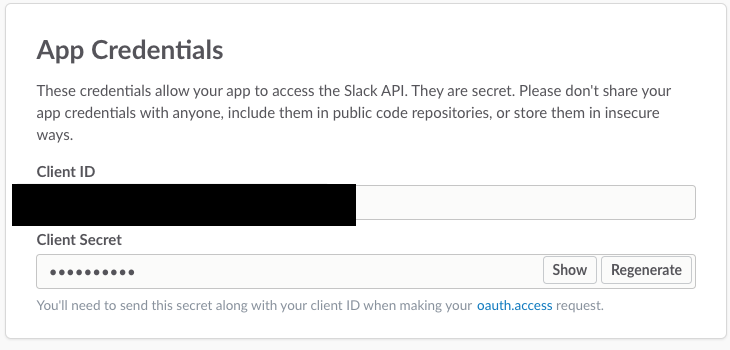
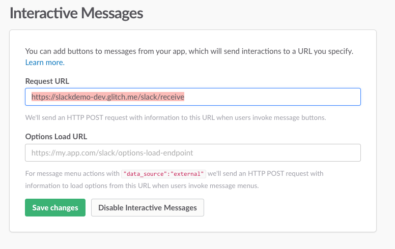
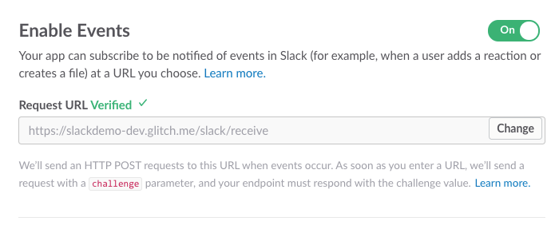

# Configure Botkit and the Slack Events API

Building a bot with Botkit and the Slack Events API gives you access to all of the best tools and options available to create the best and most feature
rich bot.

In order to get everything set up, you will need to configure a "Slack App" inside the [Slack Developer Portal](http://api.slack.com/apps), and at the same time, configure a [Botkit-powered bot](http://botkit.ai). It only takes a few moments, but there are a bunch of steps!

## 1) Create a Slack App
Go to [http://api.slack.com/apps](http://api.slack.com/apps) and create a new application record.

	

You will receive a `clientId` and a `clientSecret`. You need these values - copy them into a temporary text file for use in the following steps.

	

## 2) Turn on your Botkit app

Now that you've got your clientId and clientSecret, you can start your Botkit app. You will need to have a bot service online and reachable over the web to finish setting up your bot with Slack. 

There are a number of different ways that you can host your Botkit app, read more about this in [Botkit's Slack Readme](https://github.com/howdyai/botkit/blob/master/docs/readme-slack.md) 

## 3) Configure oauth

Botkit and Slack use the oauth authentication system to grant bots access to
connect to, read from, and send messages to Slack teams.

Click on the "Oauth & Permissions" tab in your Slack's app setting, and under
Redirect URLs, add: `https://my-bot-url/oauth`, then click save.

## 4) Add a Bot User

Click on the "Bot Users" tab and specify a name for your bot. This is the name
that will be used by default when your application creates a new bot on a user's
team.

In addition to a name, enable the option for "Always Show My Bot Online."

## 5) Set up Interactive messages

"Interactive messages" is Slack's fancy way of saying "buttons." In order to enable buttons,
under Request URL, add `https://my-bot-url/slack/receive`, then click save.

## 6) Set up Event Subscriptions

To start receiving messages, enable event subscriptions. First, under Request URL,
add `https://my-bot-url/slack/receive`. When you finish typing, Slack will verify
that this endpoint is properly configured. You must be running your Botkit application,
and the application must be accessible at the URL specified for this to work.

Once verified, click "Add Bot User Event", and using the dropdown that appears,
select all of the message.* events: `message.channels`, `message.groups`, `message.ims`, `message.mpim`.
This tells Slack to send your bot all messages that are sent in any channel or group
in which your bot is present. Add other events as needed.

*Note* : If you do not see `Bot User` here, it is likely that you forgot to add a Bot user back in step 4. Go and fix that now, and come back to step 6!

Finally, scroll to the top of the page and switch "Enable Events" to "on". Your bot is now ready to receive messages!

## 7) Add your bot to your Slack team

Now that your bot is configured, and your application is up and running, you can login and add your bot. Visit `https://my-bot-url/login`, and you will be automatically directed to Slack's login page. Login and choose a team. You'll get one more confirmation before being redirected back to your app.

Meanwhile, your bot should appear inside your Slack team! You should receive a friendly welcome message!

## 8) Customize your Bot

Using [Botkit Studio's conversation design tools](https://studio.botkit.ai) and the powerful [Botkit SDK](https://github.com/howdyai/botkit), you can build your dream bot!
