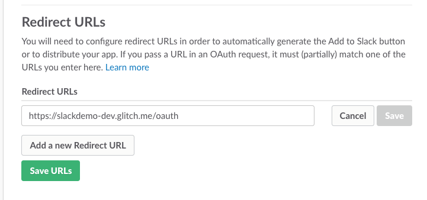

# Configure Botkit and the Slack Events API

Building a bot with Botkit and the Slack Events API gives you access to all of the best tools and options available to create a feature-rich bot for Slack.

In order to get everything set up, you will need to configure a new Slack App inside the [Slack Developer Portal](http://api.slack.com/apps), and at the same time, configure a [Botkit-powered bot](http://botkit.ai). It only takes a few moments, but there are a bunch of steps, so follow these instructions carefully. 

This feature is still in very active development at Slack, and these steps are subject to change.

## 1. Create a new Slack App

Go to [http://api.slack.com/apps](http://api.slack.com/apps) and create a new application record.

	

You will receive a `clientId` and a `clientSecret`. You need these values - copy them into a temporary text file for use in the following steps.

	

## 2. Turn on your Botkit app

Botkit Studio provides the easiest path to creating a new bot for Slack. This method will provide a guided path to hosting, along with other useful tools for creating and managing your bot. If you're already using [Botkit Studio](https://studio.botkit.ai/), this is happening in the background! 

For advanced users looking to run their own code, you will need to [install Botkit](https://github.com/howdyai/botkit-starter-slack) and run it before your bot can be configured with Slack.

Once you've collected your `clientId` and `clientSecret` tokens from Slack, you can start your Botkit app. You will need to have a bot service online and reachable over the web to complete the following steps and finish setting up your bot.

## 3. Configure OAuth

Botkit and Slack use the OAuth authentication system to grant bots access to connect to, read from, and send messages to Slack teams.

Click on the "OAuth & Permissions" tab in your Slack's app setting, and under Redirect URLs, add: `https://my-bot-url/oauth`, and save your progress.

## 4. Add a Bot User

Click on the "Bot Users" tab and specify a name for your bot. This is the name that will be used by default when your application creates a new bot on a user's team. 

In addition to a name, enable the option for "Always Show My Bot Online." This will ensure your Bot appears online to your team.

## 5. Set up Interactive Components

"Interactive Components" is Slack's fancy way of saying "buttons, or dialogs, or menus." In order to enable these, under Request URL, add `https://YOURURL/slack/receive`, then click save.

## 6. Set up Event Subscriptions

To start receiving messages, you will need to enable Event Subscriptions. Finally, scroll to the top of the page and switch "Enable Events" to "on". 

Next you will need to add your Request URL, like this: `https://YOURURL/slack/receive`. When you finish typing, Slack will verify that this endpoint is properly configured. You must be running your Botkit application at the URL specified for this to work.

Once verified, click "Add Bot User Event", and using the dropdown that appears, select all of the `message.*` events: 

* `message.channels`
* `message.groups`
* `message.ims`
*  `message.mpim`

This configuration tells Slack to send your bot all messages that are sent in any channel or group in which your bot is present. Add other events as needed. 

Your bot is now ready to receive messages!

*Problems?* : If you do not see `Bot User` here, it is likely that you forgot to add a Bot User back in Step 4. Go and fix that now, and come back to Step 6 to continue.

*Note*: If you intend on submitting to the App Directory, be sure to have a good reason to request more widely ranging events as your app can be rejected for excessively wide permissions.

## 7. Add your bot to your Slack team

Now that your bot is configured, and your application is up and running, you can login and add your bot. Visit `https://MYURL/`, and you will be automatically directed to Slack's login page. Login and choose a team. You'll get one more confirmation before being redirected back to your app.

Meanwhile, your bot should appear inside your Slack team. You should receive a friendly welcome message to indicates your bot is now online and working! 

## Additional resources 
* [Botkit Slack readme](../readme-slack.md) 
* [Slack's official documention for Events API](https://api.slack.com/events-api)
* [Sign up for Botkit Studio](https://studio.botkit.ai/signup) 
