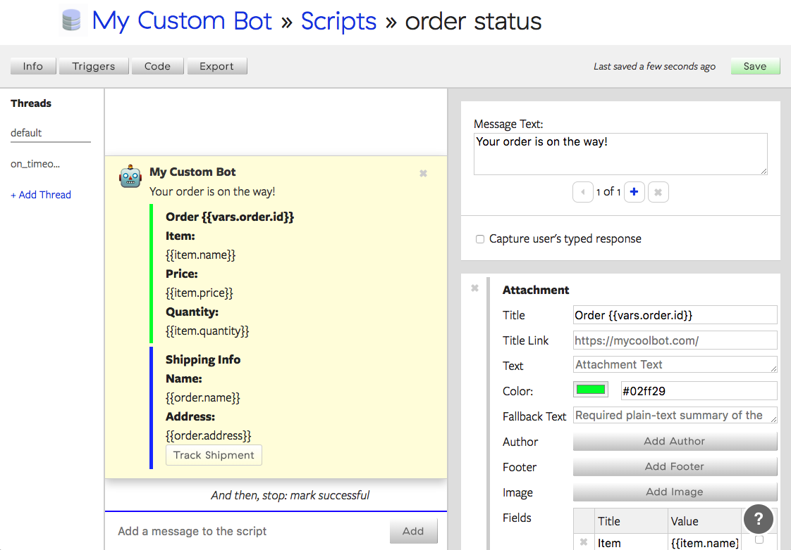

# Building with Botkit Studio

[Botkit Studio](https://studio.botkit.ai) is a hosted development tool that enhances and expands the capabilities of Botkit. While developers may use Botkit without Studio, a Studio account will substantially ease the development and deployment of a Bot, help to avoid common coding pitfalls,
a valuable management interface for the bot's dialog content and configuration. Botkit Studio is a product of [Howdy.ai](http://howdy.ai), the creators of Botkit.

This document covers the Botkit Studio SDK details only. [Start here](readme.md) if you want to learn about to develop with Botkit.

For bot developers who have existing apps but would like to benefit from features like bot-specific content management without using Botkit, you can access the [Botkit Studio SDK here](https://github.com/howdyai/botkit-studio-sdk)

Table of Contents

* [Key Features](#key-features)
* [Getting Started](#getting-started)
* [Function Index](#function-index)

## Key Features
### Why use Botkit Studio?
The goal of Botkit Studio is to make building bots with Botkit easier than ever before.
The tools and this SDK are based on feedback from dozens of Botkit developers and more than a year of building and operating our flagship bot, [Howdy](https://howdy.ai).
However, our intent is not to cover every base needed for building a successful bot. Rather, we focus on several key problem areas:

* **Script Authoring**: Botkit Studio provides a cloud-based authoring tool for creating and maintaining multi-thread conversations and scripts. Scripts managed in Studio can be changed without changing the underlying application code, allowing for content updates, feature additions and product development without code deploys. Many types of conversation will _no longer require code_ to function.

* **Trigger Management**: Developers may define trigger words and patterns externally from their code, allowing those triggers to expand and adapt as humans use the bot.

* **Easy to use SDK**: Our open source SDK provides simple mechanisms for accessing these features from within your application.  With only a few new functions: [studio.get](#controllerstudioget), [studio.run](#controllerstudiorun), and [studio.runTrigger](#controllerruntrigger), your bot has full access to all of the content managed by the cloud service. These functions can be used to build light weight integrations with Studio, or turn over complete control to the cloud brain.



The screenshot above shows the script authoring tool, where bot developers can write dialog,
manage [conversation threads](readme.md#conversation-threads), define variables to capture user input, and set triggers that will automatically activate the bot.

## Getting Started

Before you get started, it is important to note that Botkit Studio is an extra set of features
built on top of [all of the other existing Botkit features and plugins](readme.md), and all of the documentation and tutorials for those features applies to bots built with Studio as well.

If you already have a Botkit bot, you may want to start [here](#adding-studio-features-to-an-existing-bot).

The instructions below cover setting up a bot on a Slack team. However, you may also use any of the other Botkit connectors to operate a bot on [Facebook](readme-facebook.md), [Twilio](readme-twilioipm.md), or any other supported platform. Follow the instructions for configuring Botkit on those dedicated pages, then pick up below with the additional Studio configuration steps.

### Start with the Starter Kit

1) [Register for a developer account at Botkit Studio](https://studio.botkit.ai/signup)

2) Download the Botkit Studio Starter Kit [for Slack](https://github.com/howdyai/botkit-starter-slack) or [for Facebook Messenger](https://github.com/howdyai/botkit-starter-facebook). This code repository contains a fully functioning bot configured to work with Botkit Studio, and code examples demonstrating all of the key features. It also contains supporting material for the [tutorial included here](#tutorial).

3) Make a bot integration inside of your Slack channel. Go here:

https://my.slack.com/services/new/bot

Enter a name for your bot.
Make it something fun and friendly, but avoid a single task specific name.
Bots can do lots! Let's not pigeonhole them.

When you click "Add Bot Integration", you are taken to a page where you can add additional details about your bot, like an avatar, as well as customize its name & description.

Copy the API token that Slack gives you. You'll need it.

4) Inside Botkit Studio, locate the "API Keys" tab for your bot account, and copy the token.  Now you've got everything you need!

4) With both tokens in hand, run the starter kit bot application from your command line:

```
token=REPLACE_THIS_WITH_YOUR_TOKEN studio_token=REPLACE_WITH_YOUR_BOTKIT_TOKEN node .
```

5) Your bot should be online! Within Slack, send it a quick direct message to say hello. It should say hello back!

6) Create new scripts, triggers and behaviors within your Botkit Studio developer account, while connecting it to the application logic present in your bot code by using the features described [in the function index](#function-index).

### Adding Studio Features to an Existing Bot

If you've already got a bot built with Botkit, you can get started with new Studio features with only a few extra lines of code.

After you've registered for a Botkit Studio developer account, you will receive an API token that grants your bot access to the content and features managed by the Studio cloud service.  You can add this to your existing Botkit app by passing in the Studio token to the Botkit constructor using the `studio_token` field:

```javascript
// Create the Botkit controller that has access to Botkit Studio
var controller = Botkit.slackbot({
    debug: false,
    studio_token: 'MY_BOTKIT_STUDIO_TOKEN'
});
```

In order to add the Botkit Studio "catch all" handler that will activate the cloud script triggering service into your bot, add the following code to your application below all other Botkit `hears()` events. This will pass any un-handled direct message or direct mention through Botkit Studio's trigger service, and, should a matching trigger be found, execute the script.

```javascript
controller.on('direct_message,direct_mention,mention', function(bot, message) {
    controller.studio.runTrigger(bot, message.text, message.user, message.channel).catch(function(err) {
        bot.reply(message, 'I experienced an error with a request to Botkit Studio: ' + err);
    });
});
```

## The Botkit Studio Data Flow
### Keep your bot secure and your user messages private!

How do the Botkit tools handle your messages? Where do messages come from and go to?

1. The Botkit-powered application you build (and host yourself) receives messages directly from a messaging platform such as Slack or Facebook.

2. Botkit will evaluate this message locally (within your application) to match it to internally defined triggers (using `hears()` or `on()` handlers).

3. If and only if a message matches the conditions for being analyzed remotely -- by default, only messages sent directly to the bot that are not already part of an ongoing interaction -- the message is sent over an encrypted SSL channel to the Botkit Studio trigger system.

    The trigger system (using [studio.runTrigger](#controllerstudioruntrigger)) will evaluate the input message against all configured triggers, and, should one be matched, return the full content of the script to your application.

4. Botkit will _compile_ the script received from the API into a [conversation object](readme.md#multi-message-replies-to-incoming-messages) and conduct the resulting conversation. During the course of the conversation, *no messages* are sent to the Botkit Studio APIs. Said another way, while a bot is conducting a scripted conversation, all messages are sent and received directly between the application and the messaging platform.  This projects your user's messages, reduces network traffic, and ensures that your bot will not share information unnecessarily.

Our recommended best practices for the security and performance of your bot and the privacy of your users is to send as few messages to be interpreted by the trigger APIs as possible. As described above, a normal Botkit Studio bot should _only_ send messages to the API that can reasonably be expected to contain trigger words.

The bottom line is, Botkit Studio does _not_ put itself between your users and your application. All messages are delivered _first_ and directly to your application, and only sent to our APIs once specific criteria are met. This is notably different than some other bot building services that actually receive and process messages on your behalf.

## Function Index

### controller.studio.run()
| Argument | Description
|---  |---
| bot   | A bot instance
| input_text | The name of a script defined in Botkit Studio
| user | the user id of the user having the conversation
| channel | the channel id where the conversation is occurring

`controller.studio.run()` will load a script defined in the Botkit Studio authoring tool, convert it into a Botkit conversation, and perform the conversation to it's completion.

Developers may tap into the conversation as it is conducted using the [before](#controllerstudiobefore), [after](#controllerstudioafter), and [validate](#controllerstudiovalidate) hooks. It is also possible to bind to the normal `convo.on('end')` event because this function also returns the resulting conversation object via a promise:

```javascript
controller.studio.run(bot, 'hello', message.user, message.channel).then(function(convo) {
    convo.on('end', function(convo) {
        if (convo.status=='completed') {
            // handle successful conversation
        } else {
            // handle failed conversation
        }
    });
});
```

### controller.studio.get()
| Argument | Description
|---  |---
| bot   | A bot instance
| input_text | The name of a script defined in Botkit Studio
| user | the user id of the user having the conversation
| channel | the channel id where the conversation is occurring

`controller.studio.get()` is nearly identical to `controller.studio.run()`, except that instead of automatically and immediately starting the conversation, the function returns it in a dormant state.

While developers may still tap into the conversation as it is conducted using the [before](#controllerstudiobefore), [after](#controllerstudioafter), and [validate](#controllerstudiovalidate) hooks, it must first be activated using `convo.activate()` in the results of the promise returned by the function.

This enables developers to add template variables to the conversation object before it sends its first message. Read about [using variables in messages](readme.md#using-variable-tokens-and-templates-in-conversation-threads)

```javascript
controller.studio.get(bot, 'hello', message.user, message.channel).then(function(convo) {
    convo.setVar('date', new Date()); // available in message text as {{vars.date}}
    convo.setVar('news', 'This is a news item!'); // ailable as {{vars.news}}

    // crucial! call convo.activate to set it in motion
    convo.activate();
});
```


### controller.studio.runTrigger()
| Argument | Description
|---  |---
| bot   | A bot instance
| input_text | The name of a script defined in Botkit Studio
| user | the user id of the user having the conversation
| channel | the channel id where the conversation is occurring

In addition to storing the content and structure of conversation threads, developers can also use Botkit Studio to define and maintain the trigger phrases and patterns that cause the bot to take actions. `controller.studio.runTrigger()` takes _arbitrary input text_ and evaluates it against all existing triggers configured in a bot's account. If a trigger is matched, the script data is returned, compiled, and executed by the bot.

This is different than `studio.run()` and `studio.get()` in that the input text may include _additional text_ other than an the exact name of a script. In most cases, `runTrigger()` will be configured to receive all messages addressed to the bot that were not otherwise handled, allowing Botkit Studio to be catch-all. See below:

```javascript
// set up a catch-all handler that will send all messages directed to the bot
// through Botkit Studio's trigger evaluation system
controller.on('direct_message,direct_mention,mention', function(bot, message) {
    controller.studio.runTrigger(bot, message.text, message.user, message.channel).catch(function(err) {
        bot.reply(message, 'I experienced an error with a request to Botkit Studio: ' + err);
    });
});
```

In order to customize the behavior of scripts triggered using `runTrigger()`, developers define `before`, `after` and `validate` hooks for each script. See docs for these functions below.

Another potential scenario for using `runTrigger()` would be to trigger a script that includes additional parameters that would normally be provided by a user, but are being provided instead by the bot. For example, it is sometimes useful to trigger another script to start when another script has ended.

```javascript
controller.hears(['checkin'], 'direct_message', function(bot, message) {

    // when a user says checkin, we're going to pass in a more complex command to be evaluated

    // send off a string to be evaluated for triggers
    // assuming a trigger is setup to respond to `run`, this will work!
    controller.studio.runTrigger(bot, 'run checkin with ' + message.user, message.user, message.channel);
});
```

#### A note about handling parameters to a trigger

While Botkit does not currently provide any built-in mechanisms for extracting entities or parameters from the input text, that input text remains available in the `before` and `after` hooks, and can be used by developers to process this information.

The original user input text is available in the field `convo.source_message.text`. An example of its use can be see in the [Botkit Studio Starter bot](https://github.com/howdyai/botkit-studio-starter), which extracts a parameter from the help command.

```javascript
controller.studio.before('help', function(convo, next) {

    // is there a parameter on the help command?
    // if so, change topic.
    if (matches = convo.source_message.text.match(/^help (.*)/i)) {
        if (convo.hasThread(matches[1])) {
            convo.gotoThread(matches[1]);
        }
    }

    next();

});
```


### controller.studio.getScripts()
| Argument | Description
|---  |---
| bot   | A bot instance (required only when Botkit Studio token is associated with bot, not controller)

This function will return a list of all Botkit STudio scripts available to the bot.
It returns a promise that will resolve with an array of scripts. These scripts will contain
the `name`, `description`, and a list of associated `triggers`. The `name` field can be used
along with `controller.studio.get()` and `controller.studio.run()` to load the actual content of the script.

```javascript
controller.studio.getScripts().then(function(list) {

  // do something with this array of scripts.
  // list an array in the form:
  // [
  //   {
  //     name: 'script',
  //     description: 'a script',
  //     triggers: [
  //       type: 'string',
  //       pattern: 'trigger',
  //     ]
  //   }
  // ]

});
```


### controller.studio.before()
| Argument | Description
|---  |---
| script_name   | The name of a script defined in Botkit Studio
| hook_function | A function that accepts (convo, next) as parameters

Define `before` hooks to add data or modify the behavior of a Botkit Studio script _before_ it is activated. Multiple before hooks can be defined for any script - they will be executed in the order they are defined.

Note: hook functions _must_ call next() before ending, or the script will stop executing and the bot will be confused!

```javascript
// Before the "tacos" script runs, set some extra template tokens like "special" and "extras"
controller.studio.before('tacos', function(convo, next) {

    convo.setVar('special', 'Taco Boats');
    convo.setVar('extras', [{'name': 'Cheese'}, {'name': 'Lettuce'}]);

    next();

});
```


### controller.studio.after()
| Argument | Description
|---  |---
| script_name   | The name of a script defined in Botkit Studio
| hook_function | A function that accepts (convo, next) as parameters

Define `after` hooks capture the results, or take action _after_ a Botkit Studio script has finished executing. Multiple after hooks can be defined for any script - they will be executed in the order they are defined.

Note: hook functions _must_ call next() before ending, or the script will stop executing and the bot will be confused!

```javascript
// After the "tacos" command is finished, collect the order data
controller.studio.after('tacos', function(convo, next) {
    if (convo.status == 'completed') {
        var responses = convo.extractResponses();
        // store in a database
    }
    next();
});
```


### controller.studio.validate()
| Argument | Description
|---  |---
| script_name   | The name of a script defined in Botkit Studio
| variable_name | The name of a variable defined in Botkit Studio
| hook_function | A function that accepts (convo, next) as parameters

`validate` hooks are called whenever a Botkit Studio script sets or changes the value of a variable that has been defined as part of the script.

Note: hook functions _must_ call next() before ending, or the script will stop executing and the bot will be confused!

```javascript
// Validate a "sauce" variable in the "taco" script
// this will run whenever the sauce variable is set and can be used to
// alter the course of the conversation
controller.studio.validate('tacos', 'sauce', function(convo, next) {

    var sauce = convo.extractResponse('sauce');
    sauce = sauce.toLowerCase();

    if (sauce == 'red' || sauce == 'green' || sauce == 'cheese') {
        convo.setVar('valid_sauce', true);
        next();
    } else {
        convo.gotoThread('wrong_sauce');
        next();
    }

});
```

### controller.studio.beforeThread()
| Argument | Description
|---  |---
| script_name   | The name of a script defined in Botkit Studio
| thread_name | The name of a thread defined in Botkit Studio
| hook_function | A function that accepts (convo, next) as parameters

`beforeThread` hooks are called whenever a Botkit Studio script changes from one thread to another.

This works just like [convo.beforeThread()](readme.md#convobeforethread), but operates on the automagically compiled scripts managed by Botkit Studio's IDE.

Note: hook functions _must_ call next() before ending, or the script will stop executing and the bot will be confused!
Allows developers to specify one or more functions that will be called before the thread
referenced in `thread_name` is activated.

`handler_function` will receive the conversation object and a `next()` function. Developers
must call the `next()` function when their asynchronous operations are completed, or the conversation
may not continue as expected.  

Note that if `gotoThread()` is called inside the handler function,
it is recommended that `next()` be passed with an error parameter to stop processing of any additional thread handler functions that may be defined - that is, call `next('stop');`

```javascript
// This example demonstrates how to use beforeThread to capture user input, do an asynchronous operation, then display the results in a new thread
// Imagine a conversation called `search` in which the first action is to collect search terms
// the conversation then transitions to the `results` thread, before which we do the actual search!
controller.studio.beforeThread('search', 'results', function(convo, next) {

  var query = convo.extractResponse('query');
  mySearchQuery(query).then(function(results) {

    convo.setVar('results', results);
    next();

  }).catch(function(err) {

    convo.setVar('error', err);
    convo.gotoThread('error');
    next(err);

  });

});
```


## Botkit Documentation Index

* [Get Started](readme.md)
* [Botkit Studio API](readme-studio.md)
* [Function index](readme.md#developing-with-botkit)
* [Extending Botkit with Plugins and Middleware](middleware.md)
  * [Message Pipeline](readme-pipeline.md)
  * [List of current plugins](readme-middlewares.md)
* [Storing Information](storage.md)
* [Logging](logging.md)
* Platforms
  * [Slack](readme-slack.md)
  * [Cisco Spark](readme-ciscospark.md)
  * [Microsoft Teams](readme-teams.md)
  * [Facebook Messenger](readme-facebook.md)
  * [Twilio SMS](readme-twiliosms.md)
  * [Twilio IPM](readme-twilioipm.md)
  * [Microsoft Bot Framework](readme-botframework.md)
* Contributing to Botkit
  * [Contributing to Botkit Core](../CONTRIBUTING.md)
  * [Building Middleware/plugins](howto/build_middleware.md)
  * [Building platform connectors](howto/build_connector.md)
