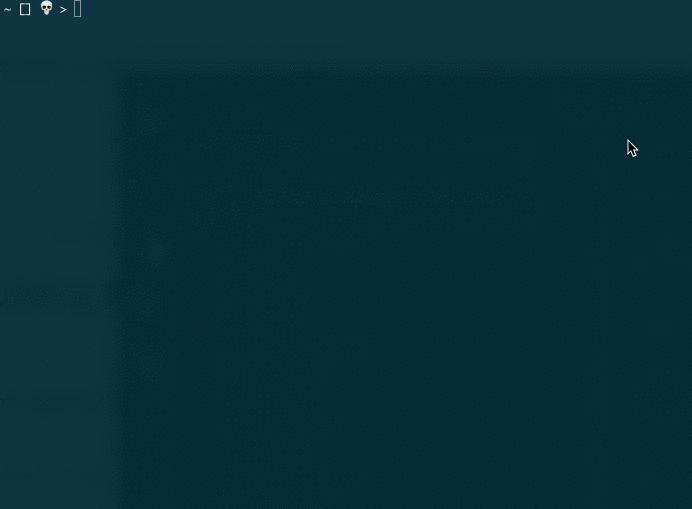

# generator-botkit
**A [Yeoman](https://yeoman.io) template for generating [Botkit](https://npmjs.org/package/botkit) applications**

## Get Started

Install Yeoman and this template:

```bash
npm install -g yo generator-botkit
```

Create a new folder for your project:

```bash
mkdir mybot
cd mybot
```

From inside your project folder, generate the project:

```bash
yo botkit
```

The generator will walk you through the process of configuring and installing your Botkit application. For each platform, a different set of API credentials and options will be collected.  [Platform specific provisioning guides can be found in the Botkit docs site &rarr;](https://github.com/howdyai/botkit/blob/main/packages/docs/provisioning/index.md)

Once the generator has completed its work, you will be left with a fully operational bot ready to be connected to the messaging platform.  To start the application, run `npm start`.  [Learn more about the anatomy of a Botkit application &rarr;](https://github.com/howdyai/botkit/blob/main/packages/docs/advanced.md#anatomy-of-a-botkit-app)

The entire process is shown below:



## Community & Support

Join our thriving community of Botkit developers and bot enthusiasts at large.
Over 10,000 members strong, [our Github site](https://github.com/howdyai/botkit) is
_the place_ for people interested in the art and science of making bots.
Come to ask questions, share your progress, and commune with your peers!

You can also find help from members of the Botkit team [in our dedicated Cisco Spark room](https://eurl.io/#SyNZuomKx)!

## About Botkit

Botkit is a part of the [Microsoft Bot Framework](https://dev.botframework.com).

Want to contribute? [Read the contributor guide](https://github.com/howdyai/botkit/blob/master/CONTRIBUTING.md)

Botkit is released under the [MIT Open Source license](https://github.com/howdyai/botkit/blob/master/LICENSE.md)